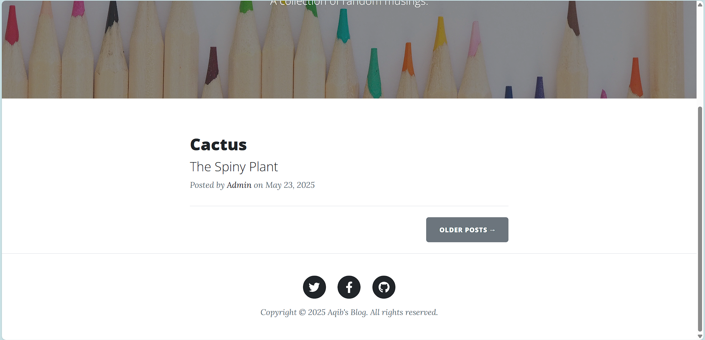
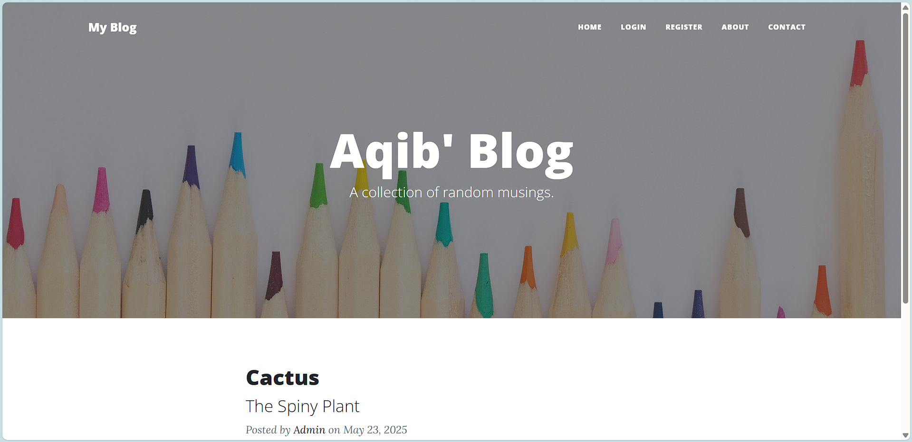
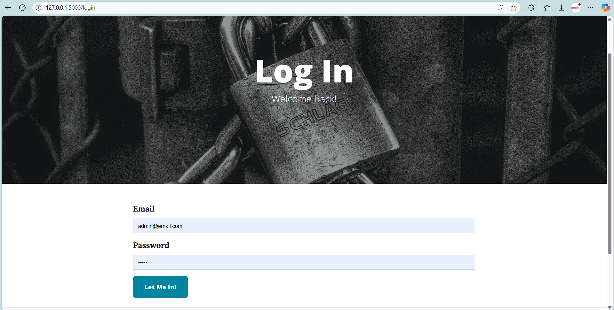
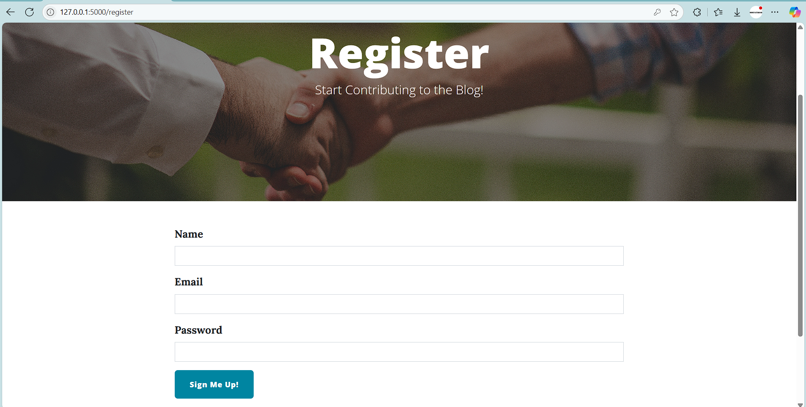
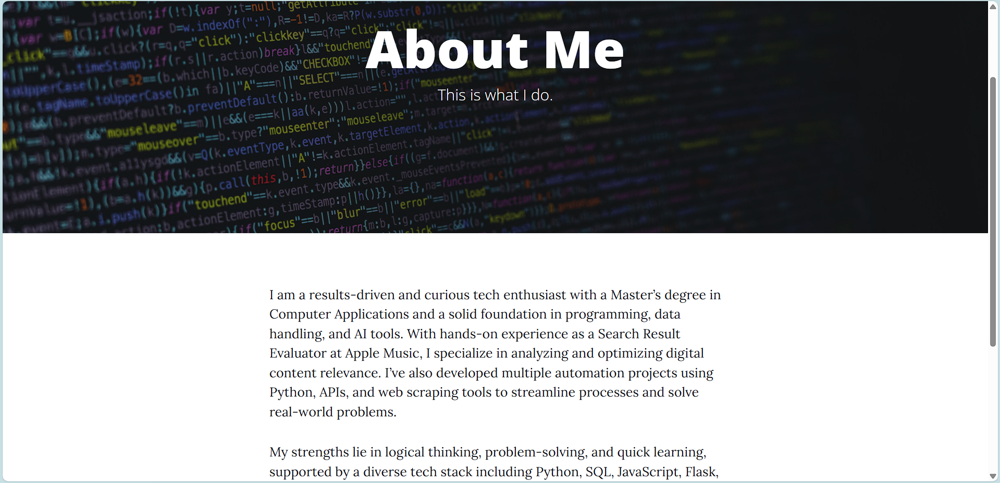
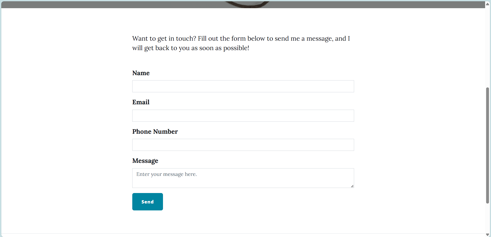
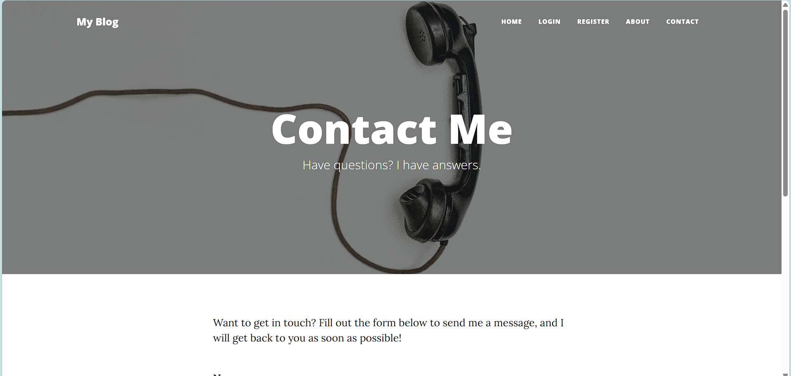

# Flask Blog CMS with User Authentication and Comments

This is a full-featured **Blog Content Management System (CMS)** built with **Flask**. It allows users to:

- Register and log in securely
- Create, edit, and delete blog posts (admin only)
- Comment on posts (authenticated users)
- Delete their own comments
- Contact the admin via email

The project includes admin-only routes, user-based comment controls, rich text editing with CKEditor, Gravatar integration, and support for environment variables via `.env`.

## ✨ Features

- 📝 Rich text blog posts (CKEditor)
- 👤 User authentication and session management (Flask-Login)
- 🔒 Secure password hashing (Werkzeug)
- 🛡 Admin-only route protection
- 💬 User comments with Gravatar avatars
- 📧 Email contact form (SMTP with Gmail)
- 🎨 Bootstrap integration (via Bootstrap-Flask)
- 🗄 SQLite database with SQLAlchemy ORM
- 📁 `instance/` folder for local database storage
- 📆 Dynamic year rendering in footer

## 🛠️ Technologies Used

- Python 3.x
- Flask
- Flask-Bootstrap
- Flask-Login
- Flask-WTF
- Flask-CKEditor
- Flask-Gravatar
- SQLAlchemy
- SQLite
- Jinja2 Templates
- `.env` for secrets/email credentials

## 📂 Project Structure

```
project/
│
├── instance/
│ └── posts.db # SQLite database (auto-created when app runs for the first time)
│
├── templates/ # Jinja2 HTML templates
├── static/ # Static assets (CSS/images)
├── forms.py # WTForms for user input
├── main.py # Main Flask application
├── requirements.txt # Python dependencies
└── README.md # This file
```

## ⚙️ Setup Instructions

## 🖥️ Running the Project in VS Code and PyCharm

### 📘 VS Code

1. **Open the project folder in VS Code**

   - Go to: `File → Open Folder` and select your project folder.

2. **Create and activate a virtual environment**

   - python -m venv venv

   Then activate it:
     
   - On Windows:
   venv\Scripts\activate

   - On macOS/Linux:
   source venv/bin/activate

3. **Install the dependencies**
   - pip install -r requirements.txt

4. **Select the correct Python interpreter**

   - Press Ctrl+Shift+P (or Cmd+Shift+P on macOS)
   
   - Choose Python: Select Interpreter

   - Select the interpreter inside the venv folder

5. **Run the application**
   - Open main.py


### 🧠 PyCharm

1. **Open the project in PyCharm**

   - Go to: File → Open and select your project folder.

2. **Set up a virtual environment**
   - Navigate to File → Settings → Python Interpreter (or PyCharm → Preferences on macOS)
   - Click the gear icon ⚙ → Add
   - Choose a New Environment using venv
   - Set the base interpreter (e.g., Python 3.10)
   - Click OK and Apply

3. **Install the required packages**
   - Right-click requirements.txt → Select Install Requirements, or
   - Use the terminal command:
   - pip install -r requirements.txt

4. **Create a Run Configuration**

   - Go to: Run → Edit Configurations
   
   - Click the + → Select Python
   
   - Set the following:

   - Name: Flask App
      
   - Script path: main.py
   
   - Working directory: your project folder

   - Python Interpreter: your virtual environment

   - Click OK, then click Run

# Don't forget to configure the credentials in the .env file


# 👮 Admin Account

   - The first user who registers becomes the admin.
   - Only the admin can create, edit, or delete blog posts.

**Admin credentials:**
- Name: Admin
- Email: admin@email.com
- Password: admin


## 🖼️ Project Screenshots

### 🏠 Home Page

<br/>


### 👤 Login Page


### 📝 Register Page


### ℹ️ About Page


### 📩 Contact Page

<br/>

